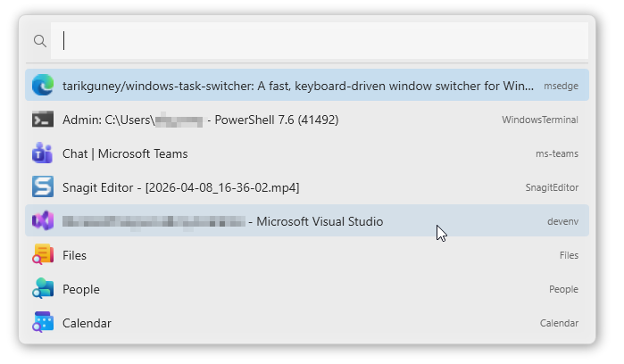

# Windows Task Switcher

A fast, keyboard-driven window switcher for Windows — find and switch to any open window in 1-2 keystrokes using fuzzy search. Inspired by [Contexts](https://contexts.co/) for macOS.

  



## Installation

### Option 1: Installer (recommended)

Download `WindowsTaskSwitcher-Setup.exe` from the [latest release](https://github.com/tarikguney/windows-task-switcher/releases/latest). The installer optionally adds Windows startup and creates Start Menu shortcuts.

### Option 2: Portable executable

Download `WindowTaskSwitcher.exe` from the [latest release](https://github.com/tarikguney/windows-task-switcher/releases/latest) — no installation needed, just run it.

### Option 3: Build from source

```bash
git clone https://github.com/tarikguney/windows-task-switcher.git
cd windows-task-switcher
dotnet run --project src/WindowTaskSwitcher
```

## Why?

Alt+Tab breaks down when you have 15+ windows open. You end up squinting at tiny thumbnails or mashing Tab repeatedly. Windows Task Switcher replaces that with a searchable list — press a key, type a few characters, and you're there.

**Before:** Alt+Tab → Tab → Tab → Tab → Tab → "was it this one?" → Tab → Enter

**After:** Ctrl+Space → `sl gen` → Enter → You're in Slack #general

## Features

- **Fuzzy search** — type any part of a window title or process name. `chdev` matches "Chrome - DevTools". `ff` matches "Firefox".
- **Smart ranking** — word-start matches score higher than mid-word. Consecutive characters score higher than scattered. The algorithm learns from your selections over time.
- **Alt+Tab replacement** — optionally override Alt+Tab to show the switcher instead of the default Windows task view (opt-in, off by default).
- **System theme aware** — automatically matches Windows dark/light mode. Switches live when you change your theme.
- **Keyboard-first** — Up/Down or Tab to navigate, Enter to switch, Escape to dismiss, Ctrl+W to close a window.
- **Lightweight** — single-file exe, ~60MB self-contained. Lives in the system tray.

## Usage

| Shortcut | Action |
|----------|--------|
| `Ctrl+Space` | Open the switcher |
| Type | Fuzzy search across all windows |
| `Up` / `Down` / `Tab` | Navigate results |
| `Enter` | Switch to selected window |
| `Escape` | Dismiss |
| `Ctrl+W` | Close the selected window |

Right-click the tray icon to:
- Toggle **Alt+Tab override** (replaces the default Windows switcher)
- Exit the app

## How the Search Works

The fuzzy matcher scores each window against your query:

| Signal | Bonus | Example |
|--------|-------|---------|
| Character at word start | +10 | `vs` matching **V**isual **S**tudio |
| Consecutive characters | +5 | `term` matching **Term**inal |
| Match at string start | +15 | `chr` matching **Chr**ome |
| CamelCase boundary | +8 | `gH` matching **g**it**H**ub |
| Gap between matches | -1 each | penalizes scattered matches |

Results are further boosted by your selection history — if you always pick Slack when you type `sl`, it floats to the top.

## Tech Stack

| Component | Choice |
|-----------|--------|
| Runtime | .NET 8.0 (LTS) |
| UI | WPF with borderless transparent overlay |
| Win32 interop | P/Invoke — EnumWindows, SetForegroundWindow, RegisterHotKey, WH_KEYBOARD_LL |
| MVVM | CommunityToolkit.Mvvm |
| Tray icon | Hardcodet.NotifyIcon.Wpf |

## Architecture

```
Ctrl+Space (or Alt+Tab)
    │
    ▼
HotkeyService ──► SwitcherViewModel.Show()
                       │
                       ├── WindowEnumerationService.GetWindows()
                       │       EnumWindows + filter (visible, not cloaked, has title)
                       │
                       ▼
                  User types ──► FuzzySearchService.Match()
                       │              score + rank results
                       │
                       ├── SearchLearningService.ApplyBoost()
                       │              frequency-based re-ranking
                       │
                       ▼
                  SwitcherWindow renders filtered list
                       │
                  Enter ──► WindowSwitchService.SwitchTo(hwnd)
                                AttachThreadInput + SetForegroundWindow
```

## Configuration

Settings are stored at `%APPDATA%\WindowTaskSwitcher\settings.json`:

```json
{
  "HotkeyModifiers": "Ctrl",
  "HotkeyKey": "Space",
  "OverrideAltTab": false,
  "RunAtStartup": false,
  "MaxResults": 15,
  "ShowPreviews": false
}
```

Search history (for learned ranking) is at `%APPDATA%\WindowTaskSwitcher\search_history.json`.

## Requirements

- Windows 10 or 11
- .NET 8.0 Runtime (included if you use the self-contained publish)

## Contributing

Pull requests welcome. The codebase is intentionally small — the goal is a sharp tool, not a framework.

## License

MIT
